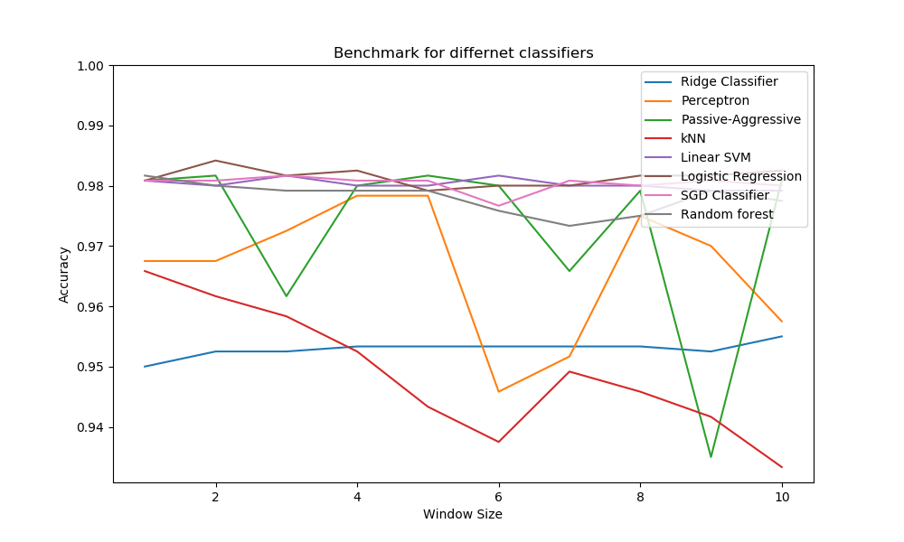

# NLP ASSIGNMENT #1
    Naveen Singh Pundir
    17111026
    CS671A: Introduction to Natural Language Processing
    IIT KANPUR
This file contains the description of techniques used in the code for [assignment1](https://www.cse.iitk.ac.in/users/hk/cs671/).

To run the python code, make sure you have `test.txt` and `fullTest.txt` present inside the `data` folder in the parent directory.

**Directory Tree:**

    Assignment1
        ├── data
        │   └── test.txt
        │   └── fullTest.txt
        └── output
        └── a1.py
        └── a2.py
        └── b.py
To run the code just write:
```bash
$ python a1.py
$ python a2.py
$ python b.py
```

**Table of Contents**
- [Requirements](#requirements)
- [Description](#description)
  * [Ques. (a) 1](#ques--a--1)
  * [Ques. (a) 2](#ques--a--2)
  * [Ques. (b)](#ques--b-)
    + [Results](#results-)

<a id="requirements"></a>
## Requirements 
Before running the scripts make sure that you have following dependencies installed in your system. 
 - [Python 3.6](https://www.python.org/downloads/)
 - [Numpy](https://pypi.python.org/pypi/numpy)
 - [Scikit-Learn](http://scikit-learn.org/)
 - [Matplotlib](https://matplotlib.org/)
 - [NLTK](http://www.nltk.org/) 

<a id="description"></a>
## Description 
This part contains the description of the solution for all the questions.
<a id="ques--a--1"></a>
### Ques. (a) 1
```
Convert single quotes in the conversation to double quotes.
```
**Solution File:**  a1.py

This part required the use of python **`re`** module to find the pattern for single quotes in the conversational text and replace them with double quotes.
But the text contains some paragraphs like this:
```
'And even then,' he said, 'we poets always ask the question, 'And
what is Victoria now that you have got there ?' You think Victoria
is like the New Jerusalem. We know that the New Jerusalem will only
be like Victoria. Yes, the poet will be discontented even in the
streets of heaven. The poet is always in revolt.'
```

Here the problem is we have quotes within the quotes. To work with such sentences, we need to preprocess the whole text and convert each inner quote to some different symbol `#`. 
Now, we can easily transform single quote to double quote using the below python code:
```python
pat = re.compile(r"(?<=\s)(?<!\w\s)'(.+?)'(?=\s)", flags=re.DOTALL)
content = pat.sub(r'"\1"', content)
content = re.sub(r"#", "'", content)
```
- (?<=\s) : Beginning quote should be preceded with a whitespace character
- (?<!\w\s) : Beginning quote should not preceded with word character and a whitespce.
- ' (.+?) ' : Starting with single quote then any character 1 or more times (non-greedy) followed by closing single quote
- (?=\s) : Each ending quote should be followed by a whitespace character.

The final output that we get of the above sentence is:
```
"And even then," he said, "we poets always ask the question, 'And
what is Victoria now that you have got there ?' You think Victoria
is like the New Jerusalem. We know that the New Jerusalem will only
be like Victoria. Yes, the poet will be discontented even in the
streets of heaven. The poet is always in revolt."
```

The output of the solution is saved in `output/output1(a)1.txt` in the parent directory.

<a id="ques--a--2"></a>
### Ques. (a) 2
```
Build a sentence terminator recognizer and tag each sentence in the 
file test.txt with a beginning of sentence and end of sentence tag as
follows: <s>’An artist is identical with an anarchist,’ he cried.</s>
```

**Solution File:**  a2.py

This part is similar to (a) 1 in the sense that we need to separate out the terminating character occuring inside the conversation. For that purpose we again do some normalization before splitting the whole text into sentences through regular expression.
```python
# Changing nested punctuation characters to different symbols
start=0
index = 0
for i in range(len(content) - 1):
    # Condition for nested quotes
    if content[i] == "'":
        if re.match(r'[A-Za-z]', content[i+1]) and re.match(r'[^\w]', content[i-1]):
            start +=1
        elif re.match(r'[\s;.?\']', content[i+1]):
            start -= 1
    # Replacing nested punctuation with new symbol
    elif content[i] == '.' and re.match(r'\d', content[i+1]):
        content[i] = '#'
    elif content[i] == '.' and start > 0 and content[i+1] != "'" and content[i+1] != '\n':
        content[i]='#'
    elif content[i] == '?' and start > 0 and content[i+1] != "'":
        content[i]='$'
    elif content[i] == '!' and start > 0 and content[i+1] != "'":
        content[i]='@'
    elif content[i] == '\n':
        start = 0
``` 
After doing this part we can now easily split our text using the following python code:
```python
text = re.split(r'\n|(?<![A-Z][A-Za-z]\.)(?<![A-Z]\.)(?<=\.)\s|(?<=\.\')\s|(?<=[?!]\')\n', text)
```
and subsequently we can append `<s>` and `</s>` to every string in the list `text`.

The final output we get is:
```
...
<s>Like the white lock of Whistler, that lit our aimless gloom, 
Men showed their own white feather as proudly as a plume.</s>
<s>Life was a fly that faded, and death a drone that stung; 
The world was very old indeed when you and I were young.</s>
<s>They twisted even decent sin to shapes not to be named: 
Men were ashamed of honour; but we were not ashamed.</s>
...
```
The output of the solution is saved in `output/output1(a)2.txt` in the parent directory.

<a id="ques--b-"></a>
### Ques. (b)
```
Build a learning based sentence terminator classifier using the context 
around the terminator character using any binary classification 
algorithm available in the Python scikit-learn library
```

**Solution File:**  b.py

Since for this question we are working on the output produced by the (a) 2, we need to replace each occurrence of `<s>` and `</s>` with `#` character.
To create the feature vector from the context of the punctuation character we can use :
- POS of the words in the context
- Characters preceded and followed by the terminator

The first task can be easily handled using `NLTK` pos tagger.
```python
# Splitting file into tokens and tagging them
tokens = nltk.word_tokenize(file)
tags = nltk.pos_tag(tokens)
```
This will give us for each word the corresponding tag. The total number of distinct tags is stored in `features`.

For the second task we simply add a column in the input matrix indicating whether particular pattern of characters appear before or after the punctuation character. For example:
```python
if i+3 <= data_len - 1 and re.match(r'[A-Z]|\'', word_list[i+3]):
                X[punc_count][d.index('CAP')] = 1
if i+1 <= data_len - 1 and re.match(r'\'', word_list[i+1]):
    X[punc_count][d.index('QOT')] = 1
if re.match(r'[A-Z][A-Za-z]\b', word_list[i-1]):
    X[punc_count][d.index('HEAD1')] = 1
if re.match(r'[A-Z]\b', word_list[i-1]):
    X[punc_count][d.index('HEAD2')] = 1
```
Then we update the `features` variable with the above added features.

Now we need to create the feature matrix. For that, we need to count the number of punctuation characters in the text and store into `terminator_count`.

The input and output arrays are defined as:
```python
X = np.zeros(shape=(terminator_count, features))
Y = np.zeros(shape=(terminator_count,))
```
To create the input and output data `X` and `Y` arrays we repeat: 

for each occurrence of the punctuation character, we compute its context using the window size. Now for all the words `x` in the window, we replace `x` with its POS tag and the corresponding entry in the `X` matrix to `1` indicating its presence in the context of that punctuation character. Also as described above we also update the context if some specified character pattern appears in the context of that character. We repeat this procedure for all the punctuation characters in the text. 

The output `Y` array is also updated along with `X` since we have supervised data. 

Now we have the `X` and `Y` matrix in place, we can test our features using the classification algorithm.
```python
# List of classifiers to be used
classifiers = [(RidgeClassifier(tol=1e-2, solver="lsqr"), "Ridge Classifier"),
            (Perceptron(max_iter=500), "Perceptron"),
            (PassiveAggressiveClassifier(max_iter=500), "Passive-Aggressive"),
            (KNeighborsClassifier(n_neighbors=10), "kNN"),
            (LinearSVC(), "Linear SVM"),
            (LogisticRegression(), "Logistic Regression"),
            (SGDClassifier(alpha=.0001, max_iter=500), "SGD Classifier"),
            (RandomForestClassifier(max_depth=30, random_state=0), "Random forest")]
```
The classifiers were evaluated on different window sizes having test size = 33% of the available data. 

<a id="results-"></a>
#### Results:

The performance of the various classifiers on different window sizes is shown below:


The best scores of the different models are:

```
Ridge Classifier : acc= 0.955 win_size= 4
Perceptron : acc= 0.978333333333 win_size= 4
Passive-Aggressive : acc= 0.981666666667 win_size= 4
kNN : acc= 0.965833333333 win_size= 1
Linear SVM : acc= 0.981666666667 win_size= 3
Logistic Regression : acc= 0.984166666667 win_size= 2
SGD Classifier : acc= 0.981666666667 win_size= 6
Random forest : acc= 0.981666666667 win_size= 1
```

Finally, the best performing model is:
`Logistic Regression with 98.41% accuracy.`
